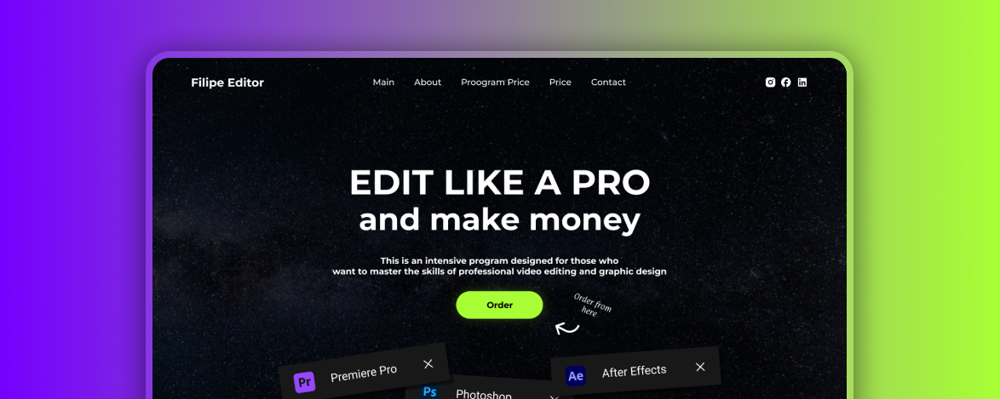

# Video Landing Page Project

### React + TypeScript + Vite

A simple landing page made with a design from figma using React, Vite, Typescript, SCSS and Jest for unit tests applying TDD

### Furture steps

- Will have unit tests with Jest

## Executing

After cloning the repository, access the project folder and execute the commands below:

```sh
npm install
npm run dev
```

Visit http://localhost:5173 to view the application.

## Useful links

- [How to setup Jest and React Testing Library in Vite project](https://zaferayan.medium.com/how-to-setup-jest-and-react-testing-library-in-vite-project-2600f2d04bdd)
- [Query a button with specific text](https://stackoverflow.com/questions/58408178/query-a-button-with-specific-text)

On solving token problem when creating typescript interfaces or types

- [Jest encountered an unexpected token when working with React TypeScript](https://stackoverflow.com/questions/65717630/jest-encountered-an-unexpected-token-when-working-with-react-typescript)
- [react-testing: userEvent.click does not work](https://stackoverflow.com/questions/73232927/react-testing-userevent-click-does-not-work)
- [ts-jest](https://www.npmjs.com/package/ts-jest)
